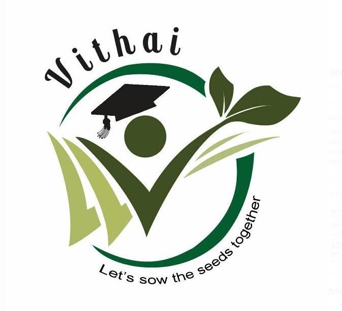

>“Real generosity toward the future lies in giving all to the present” - Albert Camus

 

Vithai is a non-profit charitable trust, composed of like-minded individuals helping provide financial support for underprivileged school students by paying their tuition fees and distributing notebooks. Vithai also encourages school students to plant trees by issuing sapling every year. 

<!--  -->

*Vithai is a non-profit charitable trust and yet to be registered officially.*

